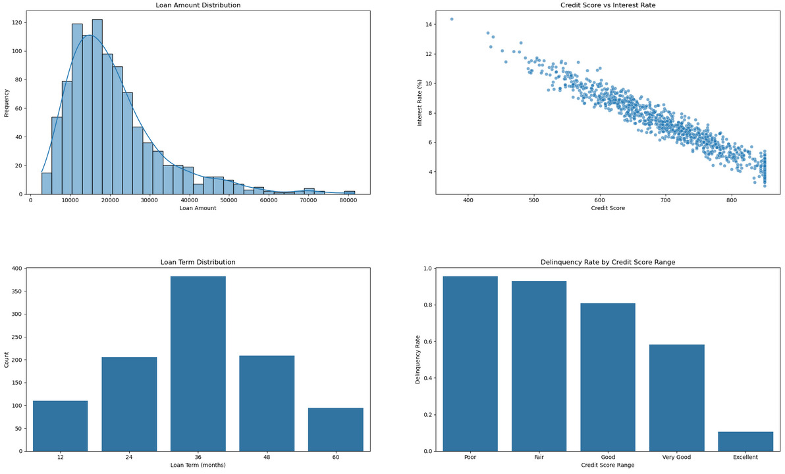

# Loan Delinquency and Its Impact on Financial Institutions in the UK

In recent years, financial institutions in the UK have faced significant challenges due to rising delinquency rates. The economic instability caused by the COVID-19 pandemic has led to an increase in loan defaults and financial losses. According to a report by S&P Global Market Intelligence, major British banks made provisions against loan losses of more than £7.5 billion in the first quarter of 2020, nearly six times the amount set aside in the same period the previous year. These provisions reflect the anticipated rise in credit losses, which are estimated to reach £18.5 billion&#8203;:[[S&P Global](https://www.spglobal.com/marketintelligence/en/news-insights/latest-news-headlines/uk-banks-loan-loss-provisions-soar-in-face-of-pandemic-58478176)]&#8203;.

The Bank of England's Financial Stability Report of June 2024 highlights that mortgage arrears are expected to rise significantly, with an estimated 128,000 cases of mortgage arrears projected by the end of 2024, up from 105,600 cases at the end of the previous year. This increase in arrears is attributed to higher living costs and economic uncertainty, affecting borrowers' ability to meet their financial obligations&#8203;:[[Bank of England](https://www.bankofengland.co.uk/financial-stability-report/2024/june-2024)]&#8203;.

Given this context, it is crucial for financial institutions to develop robust predictive models to identify and mitigate the risks associated with loan delinquencies. Our project focuses on developing analytical insights to predict loan delinquency using basic Python programming and NumPy. By leveraging historical loan data, we aim to provide financial institutions with actionable insights to enhance their risk management strategies and reduce potential losses due to delinquency.

## Insights from Loan Delinquency Analysis

1. *Loan Amount Distribution*:
   - The loan amount distribution is right-skewed, with most loans ranging between £10,000 and £30,000. This indicates that higher-value loans are less common.

2. *Credit Score vs. Interest Rate*:
   - There is a clear negative correlation between credit scores and interest rates, highlighting that borrowers with higher credit scores are offered lower interest rates.

3. *Loan Term Distribution*:
   - Medium-term loans (36 months) are the most common, suggesting borrowers prefer a balance between monthly payments and total interest paid.

4. *Delinquency Rate by Credit Score Range*:
   - Delinquency rates are highest among borrowers with poor and fair credit scores, indicating higher financial risk for these groups.

5. *Average Loan Amount by Income Range*:
   - Higher income ranges are associated with larger loan amounts, showing that income level significantly influences the loan amount approved.

6. *Correlation Heatmap*:
   - Strong positive correlations between annual income and loan amount, and negative correlations between credit score and interest rate, affirm the relationships identified in the data.

7. *Income vs. Loan Amount*:
   - A positive linear relationship between annual income and loan amount underscores that higher incomes lead to higher loan amounts.

8. *Distribution of Late Payments*:
   - Most borrowers have zero to one late payment, while a smaller proportion has multiple late payments, indicating varying levels of financial management among borrowers.
     

These insights and analysis results provide a comprehensive understanding of the loan data, highlighting key trends and relationships that can help financial institutions improve their risk management strategies. The ability to predict and mitigate loan delinquency risks can significantly enhance financial stability and profitability.

## Project Description

This project aims to analyze loan delinquency trends in financial institutions using Python and NumPy. The project involves generating synthetic loan data, performing exploratory data analysis (EDA), and visualizing the results to provide insights that can help financial institutions manage credit risks more effectively.

## Objectives

- Generate synthetic loan data to simulate real-time data.
- Perform data cleaning and preprocessing to prepare the dataset for analysis.
- Conduct exploratory data analysis to understand data distributions and relationships.
- Create visualizations to identify patterns and insights in the loan data.
- Analyze correlations between various factors such as credit score, income, loan amount, and delinquency.

## Key Features

- *Synthetic Data Generation*: Using the Faker library to generate realistic loan data, including customer details, loan amounts, interest rates, and payment histories.
- *Data Cleaning and Preprocessing*: Handling missing values, outliers, and incorrect data types to prepare the dataset for analysis.
- *Exploratory Data Analysis (EDA)*: Calculating basic statistics, visualizing data distributions, and identifying key relationships between variables.
- *Data Visualization*: Using Matplotlib and Seaborn to create insightful visualizations such as histograms, scatter plots, bar plots, and correlation heatmaps.
- *Real-Time Data Simulation*: Simulating real-time loan data to mimic a continuous data stream for dynamic analysis.

## License

This project is licensed under the MIT License. See the [LICENSE](LICENSE) file for details.

## Acknowledgments

Special thanks to the open-source community for providing the tools and libraries that made this project possible.
